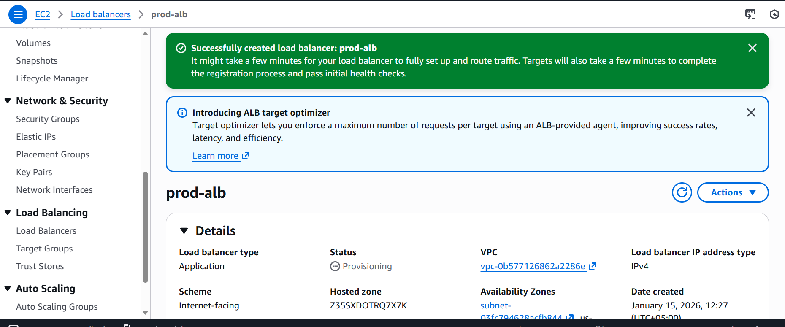

# 🚨 AWS Production Outage Simulation & Root Cause Analysis

## Overview
This project simulates a real-world AWS production outage scenario where
EC2 instances running in private subnets were unreachable through an
Application Load Balancer (ALB).

The issue was identified using CloudWatch alarms and ALB health checks,
and resolved by fixing private subnet routing using a NAT Gateway.

---

## Architecture
- VPC with public and private subnets
- EC2 instances in private subnets
- Apache HTTP server installed
- Application Load Balancer (internet-facing)
- Target Groups with health checks
- CloudWatch alarms
- NAT Gateway and Route Tables
- VPC Interface Endpoints

---

## 📸 Screenshots (Proof of Work)

### VPC Setup

### EC2 & Apache

### Load Balancer & Target Group Issue

### Monitoring & Access Issue

### Networking Fix

### Final Result

---

## Root Cause Analysis
- EC2 instances were deployed in private subnets
- No proper outbound routing initially
- ALB health checks failed
- CloudWatch alarm triggered for unhealthy hosts

---

## Resolution
- Verified Apache service running on EC2
- Fixed private subnet route table
- Enabled required networking components
- ALB target group became healthy

---

## Key Learnings
- Troubleshooting ALB health checks
- Importance of private subnet routing
- Using CloudWatch alarms for outage detection
- Real-world AWS production issue simulation

---

## Author
Muhammad Baqir Nawaz
